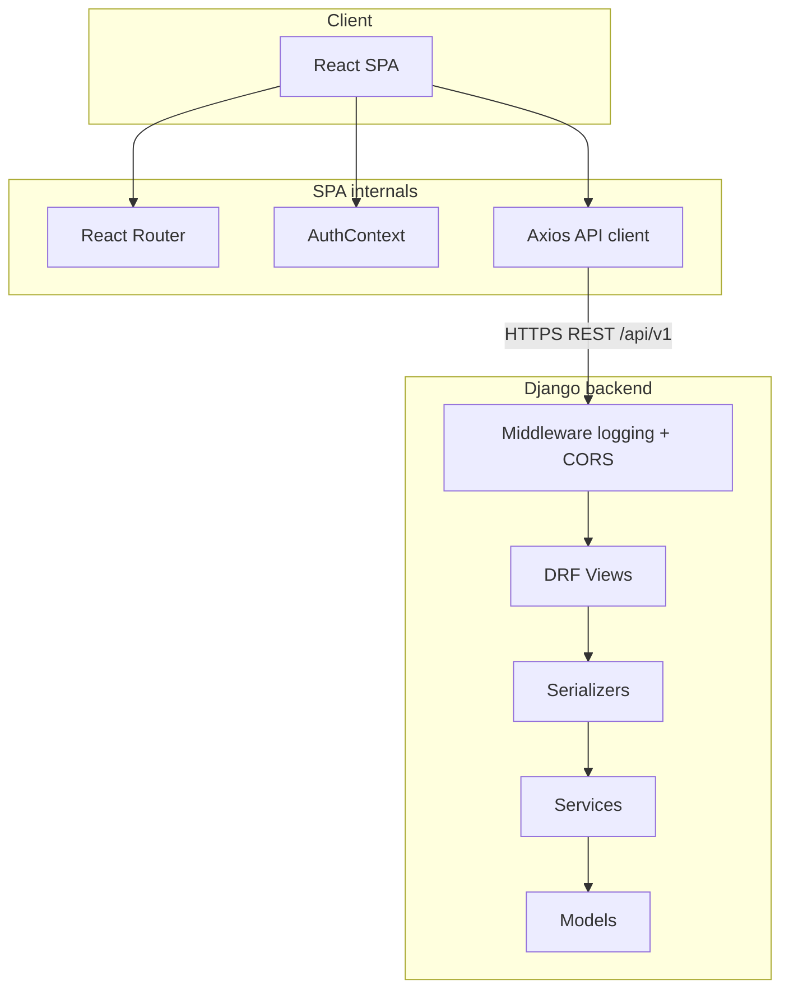

# CollabAI — Architecture overview

This document ties CollabAI layers together and points contributors to technical references.

## Detailed docs

| Layer | Document |
|-------|----------|
| Backend (DRF, OOP, middleware, permissions) | [backend_architecture.md](./backend_architecture.md) |
| Models / API (as needed) | [database-models.md](./database-models.md), [api-endpoints.md](./api-endpoints.md) |
| GitHub Issues wording (paths, no ambiguity) | [github-issues-sync.md](./github-issues-sync.md) |

## High-level view

## Backlog guidelines

1. **HTTP/HTTPS & REST** — Endpoints live under `/api/v1/…`; HTTPS is enforced in production via reverse proxy (e.g. nginx).
2. **DRF** — Validation in serializers; business logic in services; permissions in `common.permissions` or the owning app.
3. **OOP** — Extend `common.models.BaseModel`, use `apps.core.views.BaseAPIView` for custom views where appropriate, inherit services from `BaseService`.
4. **Frontend** — Use `REACT_APP_*` in `.env`; do not commit `.env`; route HTTP calls through `src/api/api.js`.

## Done checklist per story

- [ ] Code matches `architecture.md` / `backend_architecture.md`
- [ ] Automated tests pass (`backend`: `python manage.py test`; `frontend`: `npm test` when applicable)
- [ ] New endpoints appear in Swagger (`/api/docs/`)
- [ ] `.env.example` updated when new variables are introduced
