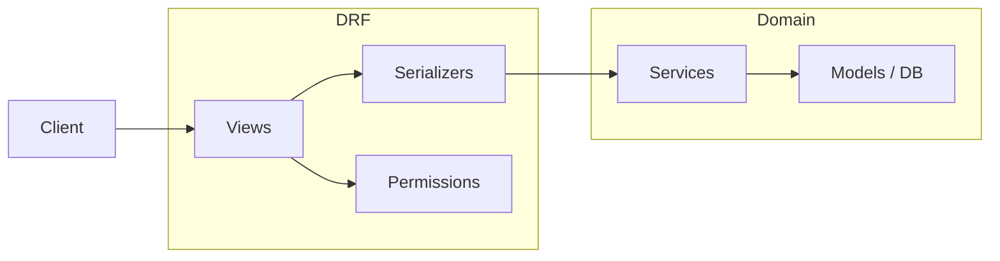

# CollabAI Backend Architecture

## 1. Directory layout (`backend/`)

```
backend/
├── manage.py
├── requirements.txt
├── config/
│   ├── settings.py
│   ├── urls.py              # /admin, /api/v1/, schema, Swagger UI
│   ├── api_v1_urls.py       # Versioned includes (organizations, tasks, …)
│   ├── middleware.py
│   ├── celery.py
│   └── asgi.py / wsgi.py
├── apps/
│   ├── core/           # Auth bootstrap (register), shared API entry
│   ├── organizations/  # Multi-tenancy roots (course requirement #19)
│   ├── workspaces/
│   ├── projects/
│   ├── tasks/
│   ├── comments/
│   ├── notifications/
│   ├── ai_assistant/   # OpenAI integration (#16) — routes under /api/v1/ai/
│   ├── audit_logs/
│   └── user_profiles/  # Extensions beyond django.contrib.auth User
└── common/             # BaseModel, permissions, pagination, utils
```

Each domain app (`apps.<name>`) keeps code grouped by responsibility:

| Folder / module | Responsibility |
|-----------------|----------------|
| `models.py`, `models/` | ORM models extending `common.models.BaseModel` |
| `serializers.py` | Validation and API representation (no heavy business logic) |
| `views.py`, `views/` | DRF endpoints; prefer `generics.*` or `BaseAPIView` for custom handlers |
| `services/` | Business logic (e.g. `RegisterService`) subclasses `BaseService` |
| `permissions/` | Re-export from `common.permissions` or app-specific permission classes |
| `mixins/` | Shared behaviour composed into views |

---

## 2. OOP principles

| Principle | How it applies |
|-----------|----------------|
| **Inheritance** | Models extend `BaseModel`; services extend `BaseService`; permissions subclass `BasePermission`. |
| **Abstraction** | `BaseAPIView`, `BaseService`, shared serializers define common contracts. |
| **Encapsulation** | User creation and similar rules live in **services** (e.g. `RegisterService.register_user`). |
| **Polymorphism** | Override methods in subclasses (permissions, services, serializers). |

---

## 3. DRF guidelines

- **Serializers** — Validation and representation only; delegate `create()` to services when a cohesive domain operation exists.
- **Views** — HTTP orchestration (status codes, permissions, calling serializer/service).
- **Services** — Side effects and domain rules (user creation, project workflows, etc.).
- **REST** — Plural resource names where appropriate; `POST /api/v1/auth/register` for collection-style auth; correct status codes (201, 400, 401, 403, 404).

---

## 4. Naming conventions

| Artifact | Convention | Example |
|----------|------------|---------|
| Model | PascalCase | `Project`, `Task` |
| Serializer | `ModelNameSerializer` | `RegisterSerializer` (use-case specific is fine) |
| View (class) | `Purpose` + `APIView` / `View` | `RegisterView`, `ProjectListAPIView` |
| Service | `Purpose` + `Service` | `RegisterService` |
| URL path | kebab-case under `/api/v1/` | `/api/v1/auth/register` |

---

## 5. Permissions & authentication

- **Current**: Django session auth for admin; public registration endpoints as defined on views.
- **Custom**: `common.permissions.IsOwner` for objects exposing `obj.user`.
- **Roadmap**: JWT via `djangorestframework-simplejwt` (`REST_FRAMEWORK['DEFAULT_AUTHENTICATION_CLASSES']`).

RBAC later: Django groups/permissions or explicit role fields — document in the relevant issue/story.

---

## 6. Middleware

| Middleware | Location | Purpose |
|------------|----------|---------|
| `RequestLoggingMiddleware` | `config/middleware.py` | Log method, path, status, duration |
| `CorsMiddleware` | `django-cors-headers` | Allow local SPA (`localhost:3000`) to call the API |

Registered in `settings.MIDDLEWARE`. Logger `config.middleware` is `INFO` to console in development.

---

## 7. Component diagram



---

## 8. Code organization habits

1. Do not put business rules in serializers except delegation into a service.
2. Prefer imports from `common.*`; avoid copying base classes — extend `common` and optionally thin re-export inside an app.
3. Document every public endpoint with `@extend_schema` (Spectacular).
4. Keep API tests in each app’s `tests.py` or under `tests/api/` as the repo grows.

`apps.core.views.BaseAPIView` and `apps.core.mixins.BaseMixin` are intentionally minimal: subclass them when you add custom endpoints that share behaviour (avoid copying boilerplate across apps).

Use `common.pagination.StandardPagination` as the global default (`REST_FRAMEWORK`); override `pagination_class = None` on views that must not paginate if needed.

